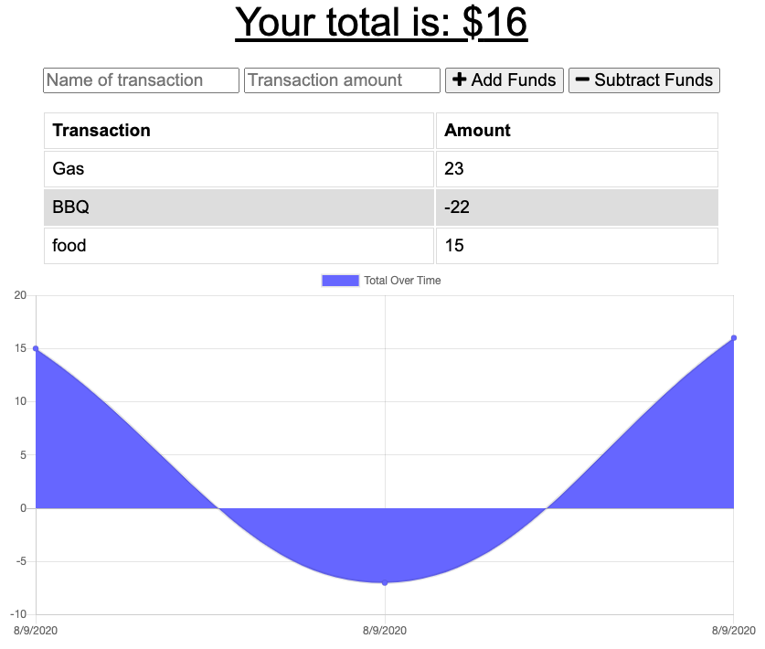

# Budget-Tracker
 An app that allows users to track their incoming and outgoing money flow while they are travelling, regardless of whether they are online or offline. The app utilizes mongodb (while online) and indexeddb (while offline) to record the transactions, and when the user goes back online, all temporary data stored in indexeddb will be uploaded to mongodb for consolidation.
 ### Screenshot
 

 ### GitHub:https://github.com/wsglobe/Budget-Tracker

 ### Heroku:https://budget-tracker-for-travel.herokuapp.com